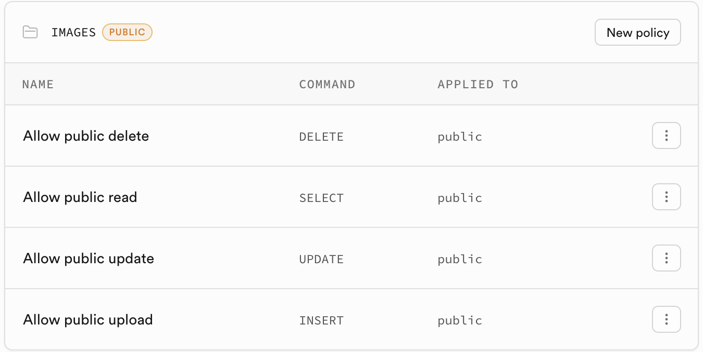
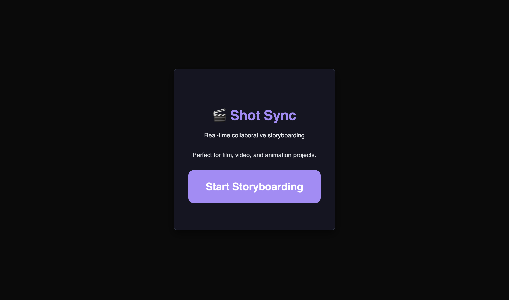
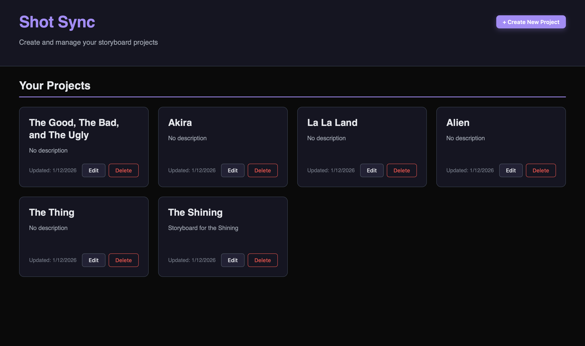
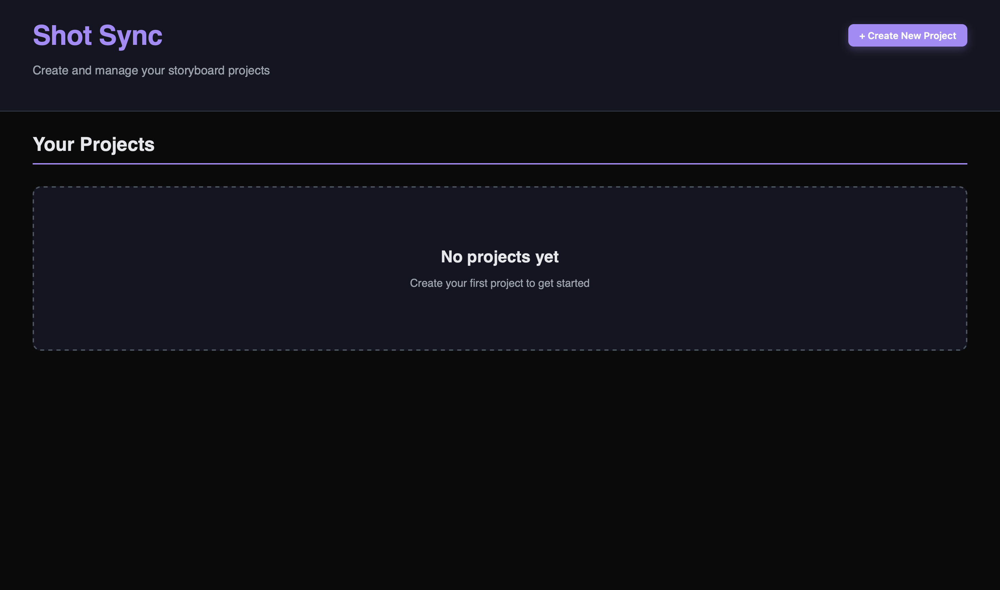
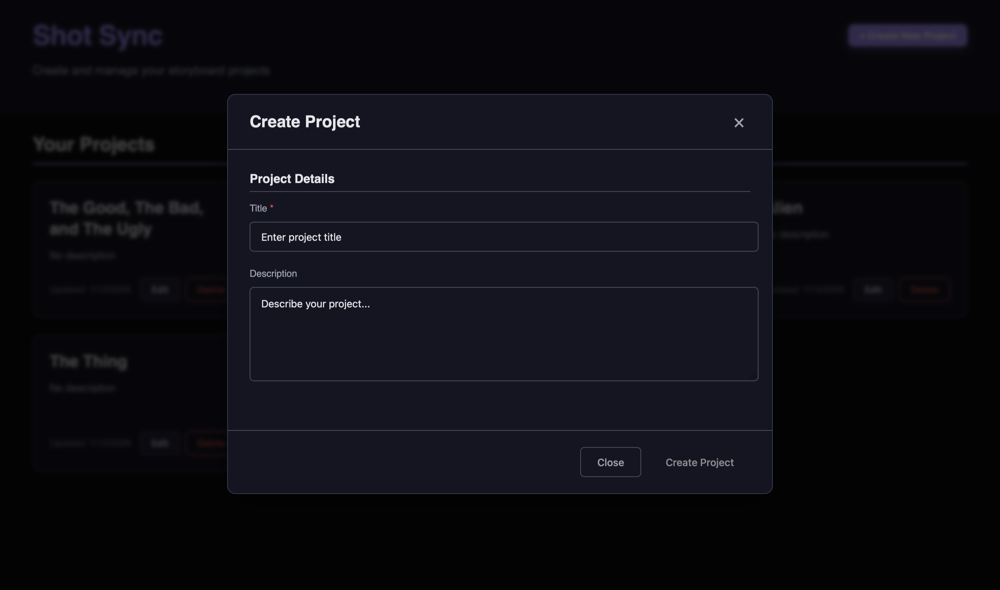
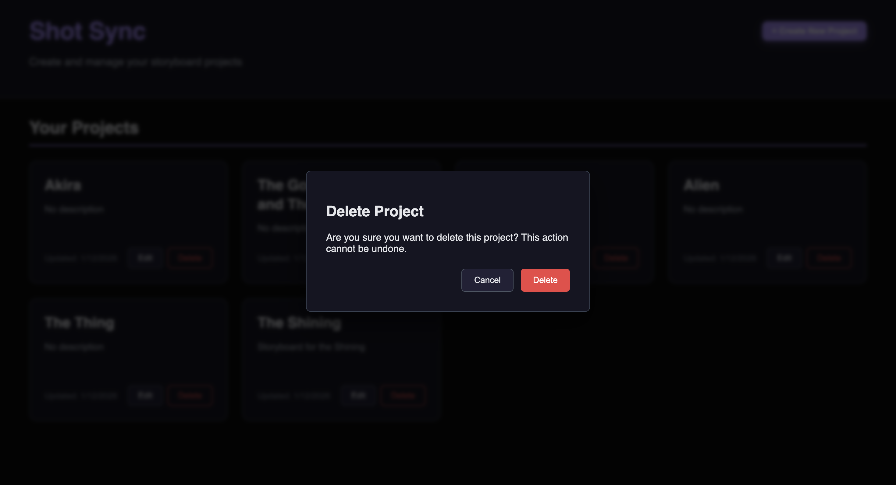
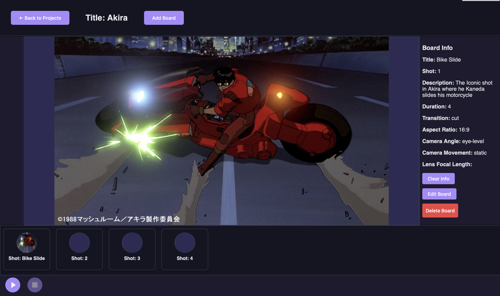
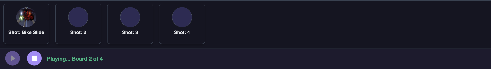

# Collaborative Storyboarding Application

  
## Overview
  
  A collaborative storyboarding web application built with React and Vite that enables multiple users to plan, visualize, and document film or animation projects. The platform offers a structured system for managing projects and boards, along with an animatic feature that allows users to create storyboards with detailed visuals and descriptive elements. Additionally, this application has real-time editing/viewing and safety locking mechanisms to support the collaborative aspect of the application. The app is designed to use Supabase (Postgres, Storage, WebSockets) as the backend
  

---

## Features

  
- Create and manage projects and shots

- Add boards within projects containing titles, descriptions, and visual elements

- Upload and preview images for storyboard panels

- Record metadata such as camera angle, lens focal length, transitions, and duration

- Drag-and-drop reorganization

- Animatic Functionality 

- Safety locking

- Realtime editing/viewing

- Maintain relationships between projects and boards using a relational schema

  

---

## Tech Stack


- **Frontend:** React + Vite

- **Backend:** Supabase (PostgreSQL, Storage, WebSockets)

- **Version Control:** Git / GitHub


--- 
  

## Running The Project

Prerequisites:

- Node.js v16+
	- Node.js - Download from: [Node.js](http://nodejs.org)

- A Supabase project (for the database and storage)
	- Sign up at [Supabase](https://supabase.com)(free tier available) - Click on "Start your project" option
	- You will need your Supabase project URL and API key for configuration (more information found in ***Environment and Supabase section***)

Steps:

1. Clone the repository and install dependencies using command line

```bash

git clone https://github.com/Chrisvann1/Collaborative-Storyboarding-Application.git

cd Collaborative-Storyboarding-Application/

npm install

```

2. Create a `.env` file in the project root with your Supabase credentials
- SUPABASE_URL - Found in Data API section of project settings
- SUPABASE_KEY - Found in API Keys section of project settings

```

VITE_SUPABASE_URL=https://your-project.supabase.co

VITE_SUPABASE_KEY=your-anon-or-service-key

```

- Do NOT commit .env file to source control 

3. Navigate to SQL editor in Supabase web application and copy and paste the ***supabase_complete_schema.sql*** file content into this SQL editor and click the green run button. 
	- Creates the projects cloud-based database, PostgreSQL functions, triggers, "images" storage bucket, and storage bucket policies
	- Image storage bucket policies should appear as below (can be found by navigating to ***Storage***, then ***Files***, and then ***Policies***):

   


4. Run the dev server

```bash

npm run dev

```

5. Open http://localhost:5173 in your browser (Vite will show the exact URL in the console).

---

## Project structure (high level)


```

.

├─ index.html

├─ package.json

├─ vite.config.js

├─ lib/

│ └─ supabase-client.ts # alternative TS client using env var VITE_SUPABASE_API_KEY

├─ src/

│ ├─ main.jsx # app entry

│ ├─ App.jsx # top-level routes and layout

│ ├─ index.css # global styles

│ ├─ supabase-client.js # main Supabase client (uses VITE_SUPABASE_KEY)

│ ├─ assets/

│ │ ├─ PlayButton.jsx

│ │ └─ StopButton.jsx

│ └─ components/

│ ├─ AddModal.jsx

│ ├─ BoardButton.jsx

│ ├─ Boards.jsx

│ ├─ CreateProjectButton.jsx

│ ├─ CreateProjectModal.jsx

│ ├─ DeleteBoardModal.jsx

│ ├─ DeleteProjectModal.jsx

│ ├─ EditModal.jsx

│ ├─ EditProjectModal.jsx

│ ├─ LoginButton.jsx

│ └─ styles/ # component CSS modules

│ ├─ Boards.module.css

│ ├─ Button.module.css

│ ├─ LoginButton.module.css

│ └─ Modal.module.css

└─ src/pages/

├─ CreateProject.jsx

├─ EditProject.jsx

└─ Login.jsx

```

Files of interest:

- `src/main.jsx` — React entry file

- `src/App.jsx` — application routing and layout

- `src/supabase-client.js` and `lib/supabase-client.ts` — Supabase initialization

- `src/pages/*` — page-level route components (Create, Edit, Login)

- `src/components/*` — UI building blocks (modals, buttons, board list)
--- 

## Application User Interface Overview

### Website Entry Page



### Project Page Essential UI Elements
#### Project Page W/ Projects Present 



#### Project Page W/ No Projects



#### Create/Edit Project Modal 
- Note - Edit board has a different header



#### Delete Modal 



### Edit Project Page Essential UI Elements 
- This is where the actual storyboarding is done

#### Specific Project Page (when you actually navigate to a specific project)



#### Edit/Add Board Modal 
- Notes:
	- Add board has a different header
	- This is scrollable - the rest of this modal cannot be seen in this image

 


#### Animatic Bar 
- Note - As the animatic feature iterates through the boards, the large central area for the currently selected board's image will change accordingly
  


#### Delete Board Modal
- Same UI as delete project modal seen above

### Additional Notes
- There are also descriptive error messages that appear for the user if an action cannot be completed. 
	- Example - If someone is in the middle of editing a board and someone else tries to delete it, there will be a message saying "Board cannot be deleted: it is currently being edited."
## Database Schema Overview

The application uses a PostgreSQL database (via Supabase) to manage projects, storyboard boards, and real-time collaboration locks. The schema supports concurrent editing, session tracking, and race-condition-safe operations.

### Primary Tables
#### `projects`

Stores high-level information about each film or animation project.

|Column|Type|Description|
|---|---|---|
|id|int8 (PK)|Unique project identifier|
|created_at|timestamptz|Project creation timestamp|
|title|text|Project title|
|description|text|Project description|
|updated_at|timestamptz|Last update timestamp|


#### `boards`

Represents individual storyboard boards (shots) within a project, including visual, technical, and timing details.

|Column|Type|Description|
|---|---|---|
|id|int8 (PK)|Unique board identifier|
|created_at|timestamptz|Board creation timestamp|
|title|text|Board title|
|shot|int8|Shot number within the project|
|description|text|Shot description or notes|
|duration|int8|Shot duration in seconds|
|transition|text|Transition type (e.g., cut, fade)|
|aspect_ratio|text|Aspect ratio|
|camera_angle|text|Camera angle|
|camera_movement|text|Camera movement details|
|lens_focal_mm|int8|Lens focal length (mm)|
|image_url|text|URL to storyboard image|
|updated_time|timestamptz|Last update timestamp|
|project_id|int8 (FK → projects.id)|Associated project|

### Collaboration & Locking Tables

These tables support real-time collaboration by managing edit locks and active user sessions. They are used in conjunction with PostgreSQL advisory locks to prevent conflicting edits and race conditions.


#### `exclusive_resource_locks`

Tracks **exclusive locks** for resources that can only be edited by one user at a time (e.g., boards or project edit sessions).

|Column|Type|Description|
|---|---|---|
|resource_type|text (PK)|Type of locked resource (`board`, `project_edit`)|
|resource_id|int (PK)|ID of the locked resource|
|locked_by|text|Client identifier holding the lock|
|expires_at|timestamptz|Lock expiration timestamp|
|created_at|timestamptz|Lock creation timestamp|
|updated_at|timestamptz|Last update timestamp|

**Primary Key:** `(resource_type, resource_id)`


#### `not_exclusive_resource_locks`

Tracks **non-exclusive (shared) locks** for resources that allow multiple concurrent users (e.g., active project sessions).

|Column|Type|Description|
|---|---|---|
|resource_type|text (PK)|Type of locked resource (`project_session`)|
|resource_id|int (PK)|ID of the locked resource|
|locked_by|text (PK)|Client identifier holding the session lock|
|expires_at|timestamptz|Session expiration timestamp|
|created_at|timestamptz|Session start timestamp|
|updated_at|timestamptz|Last update timestamp|

**Primary Key:** `(resource_type, resource_id, locked_by)`

### Locking Strategy (Summary)

- **Exclusive locks** prevent simultaneous edits to the same board or project.
    
- **Non-exclusive locks** allow multiple users to be active in a project while tracking session presence (while still preventing deletes of a project if any user has a session lock). 
    
- Locks are **time-bound (TTL-based)** and refreshed periodically to avoid stale sessions.
    
- PostgreSQL **advisory locks** are used alongside lock tables to ensure transactional safety.

--- 
## Contributions

- Name - Christopher Vann 
- Email - Christopherdvann123@gmail.com

---

## Potential Future Extensions

- Commenting system

- Export options

- In-app drawing functionality

- Role-based permissions
